# Example Voting App

A simple distributed application running across multiple Docker containers.

## Getting started

Download [Docker Desktop](https://www.docker.com/products/docker-desktop) for Mac or Windows. [Docker Compose](https://docs.docker.com/compose) will be automatically installed. On Linux, make sure you have the latest version of [Compose](https://docs.docker.com/compose/install/).

This solution uses Python, Node.js, .NET, with Redis for messaging and Postgres for storage.

Run in this directory to build and run the app:

```shell
docker compose up
```

The `vote` app will be running at [http://localhost:5000](http://localhost:5000), and the `results` will be at [http://localhost:5001](http://localhost:5001).

Alternately, if you want to run it on a [Docker Swarm](https://docs.docker.com/engine/swarm/), first make sure you have a swarm. If you don't, run:

```shell
docker swarm init
```

Once you have your swarm, in this directory run:

```shell
docker stack deploy --compose-file docker-stack.yml vote
```

## Architecture


* A front-end web app in [Python](/vote) which lets you vote between two options
* A [Redis](https://hub.docker.com/_/redis/) which collects new votes
* A [.NET](/worker/) worker which consumes votes and stores them in…
* A [Postgres](https://hub.docker.com/_/postgres/) database backed by a Docker volume
* A [Node.js](/result) web app which shows the results of the voting in real time

## Instrumentation
**Note: At any point during the below steps, feel free to look at the `instrumented-version` branch of this repo [here](https://github.com/mchavez-newrelic/example-voting-app/tree/instrumented-version) for reference.**
<details>
 <summary>Account Setup</summary>
 
- You'll need a New Relic account. The good news is that you can create a free account [here](https://newrelic.com/signup) (no credit card required).
</details>

### Python Agent
<details>
 <summary>Python Agent Installation</summary>
 
* Once you've created an account, you can begin installing the agent by first clicking the `Add Data` tab on the left hand navigation pane, as shown below. 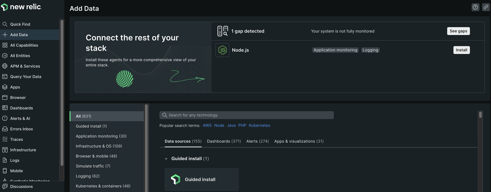
* Search for the Python agent in the `Search for any technology` search bar and click the Python agent under the `Application monitoring` section as shown below. 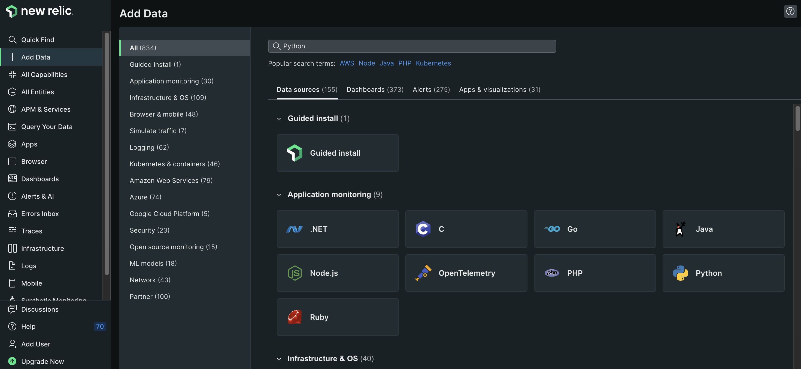
* Next, give your application a name
* Install the New Relic agent into the voting app Docker container by following the below steps
  * Add the `newrelic` Python module as a dependency in the `/vote/requirements.txt` file
  * Copy the `newrelic.ini` file as shown below into the `/vote` directory of the project folder. 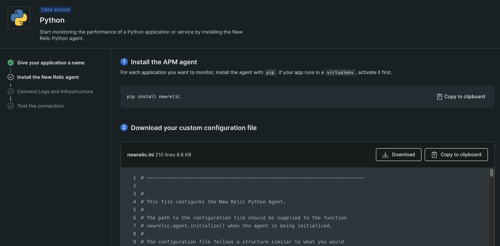
  * Add the `NEW_RELIC_CONFIG_FILE` as an environment variable in the `docker-compose.yml` file to point to the `newrelic.ini` file. 
  * Add the `newrelic-admin run-program` commands in front of the existing `python app.py` command for the vote Docker service.
  * Your `vote` service in your `docker-compose.yml` file should look like the code [here](https://github.com/mchavez-newrelic/example-voting-app/blob/418fd6dcbd60642ec2ab30932827b934711cec9f/docker-compose.yml#L6):
* Next, connect your infrastructure by running the given Docker command as shown below. 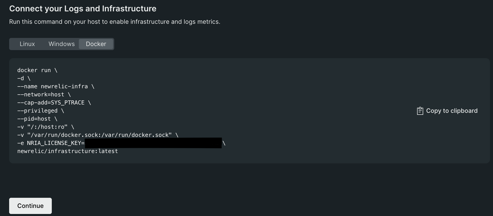
* Run your application with `docker compose up` in the project directory
* Finally, test the connection to the Python agent and your infrastructure. You should see results similar to the screenshot below. It is ok for the `On-host logs` connection to fail. 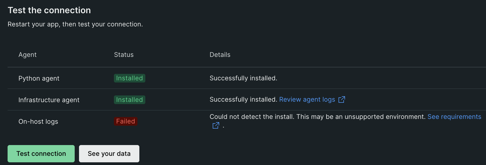
</details>
 
<details>
 <summary>Troubleshooting Python Agent Installation</summary>
 
* If the connection to the Python agent fails in the last step. 
  * First tear down your Docker containers with `docker compose down`
  * Try running the following command to forcefully rebuild your images: `docker compose build --no-cache`
  * Then try running `docker compose up` again to start your containers
* If the connection to the Infrastructure agent fails in the last step.
  * Try running the Linux install command instead of the Docker command as shown below. 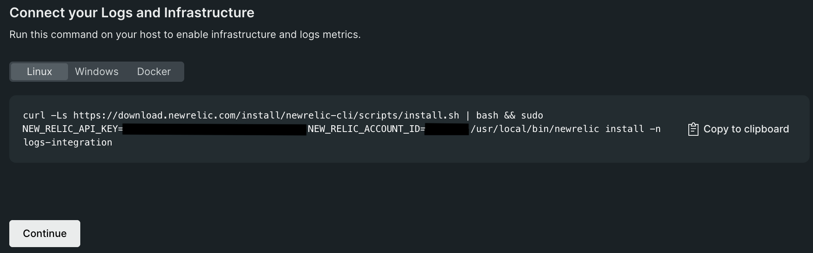
</details>

### .NET Agent
<details>
  <summary>.NET Agent Installation</summary>
 
* You can begin installing the .NET agent by first clicking the **Add Data** tab on the left hand navigation pane, as shown below. 
* Search for the .NET agent in the **Search for any technology** search bar and click the .NET agent under the **Application monitoring** section as shown below. 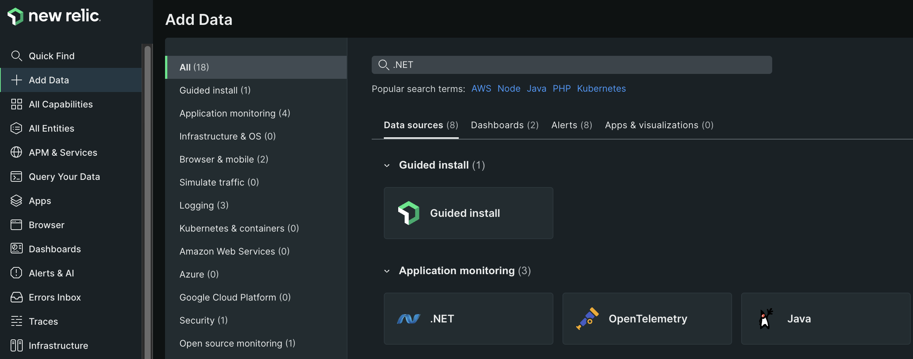
* Next, give your application a name, preferably different from the name given to your Python Agent. For example, you can name the .NET application `example-voting-app-worker` in your New Relic account.
* We will be following the steps linked [here](https://docs.newrelic.com/install/dotnet/?deployment=linux&docker=yesDocker) to install and enable the .NET agent inside our .NET Docker container.
  * Replace the code in your `/worker/Dockerfile` file for your .NET worker to be as shown [here](https://github.com/mchavez-newrelic/example-voting-app/blob/instrumented-version/worker/Dockerfile).
  * Make sure to replace `YOUR_LICENSE_KEY` and `YOUR_APP_NAME` with your New Relic license key and .NET application name respectively inside the `ENV` command at the bottom of the Dockerfile. If you would like to know where to find your license key, you can follow instructions [here](https://docs.newrelic.com/docs/apis/intro-apis/new-relic-api-keys/).
</details>

<details>
  <summary>.NET Worker Custom Instrumentation</summary>

* If you have installed the .NET agent inside the .NET worker Dockerfile, we can begin adding custom instrumentation to monitor the .NET worker's transactions. 
  * Let's first make sure we install the `NewRelic.Agent.Api` package in our project's PackageReference.
  * Replace your /worker/Worker.csproj file with the code [here](https://github.com/mchavez-newrelic/example-voting-app/blob/418fd6dcbd60642ec2ab30932827b934711cec9f/worker/Worker.csproj#LL12C6-L12C6) so we can install the `NewRelic.Agent.Api` package.
* Let's begin with a simple task of tracking the `UpdateVote` transaction inside the `/worker/Program.cs` file for the .NET worker.
  * Place the following line at the top of your `Program.cs` file: `using NewRelic.Api.Agent;` as shown [here](https://github.com/mchavez-newrelic/example-voting-app/blob/418fd6dcbd60642ec2ab30932827b934711cec9f/worker/Program.cs#L10).
  * Place a `[Transaction]` decorator directly above the `UpdateVote` function as shown [here](https://github.com/mchavez-newrelic/example-voting-app/blob/418fd6dcbd60642ec2ab30932827b934711cec9f/worker/Program.cs#L134).
  * The above steps will import the `NewRelic.Api.Agent` package into our worker's code and will create a custom transaction that can be tracked in New Relic whenever the `UpdateVote` function is called.
* Try interacting with the app so the worker can process some votes and so we can begin seeing data in our New Relic account! 
  * Navigate to `APM & Services` on the left hand navigation pane and click the application name given to your .NET worker. Click the `Transactions` section on the navigation pane.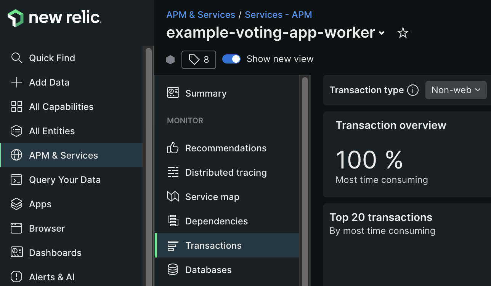
  * You should begin to see data showing up in New Relic as shown below: 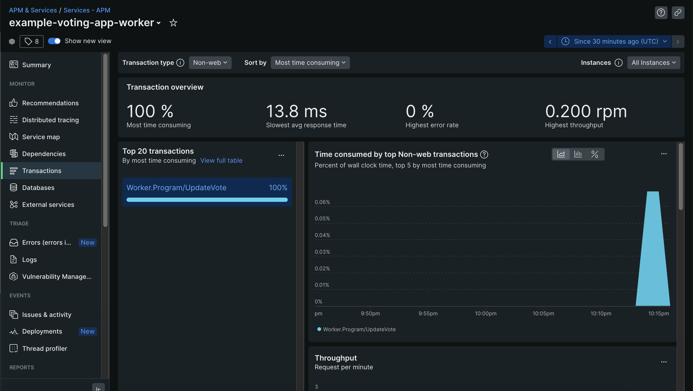
* As of now, we've only added custom instrumentation for tracking the `UpdateVote` transaction. Let's try adding custom instrumentation for tracking our query to the Redis server!
  * To do this, we'll need to extract our call to the Redis server into its own function rather than being called directly in the `Main` function. 
  * Try poking around in the main function in `/worker/Program.cs` to see if you can find the call being made to Redis. Then, try extracting this call into its own function and decorating it with a `[Transaction]`. You should have a final result that looks like [this](https://github.com/mchavez-newrelic/example-voting-app/blob/cef8d9cffadc0761b585f0c65f87ea6fc887a037/worker/Program.cs#L156).
  * Let's restart our application and interact with the vote counter to make some calls to the Redis server. You should begin to see data in your New Relic account as shown below. 
  * This is really cool as we're now adding custom instrumentation to track a couple important transactions that are being made in our .NET worker! Feel free to add more custom instrumentation as you'd like, and you can also reference documentation [here](https://docs.newrelic.com/docs/apm/agents/net-agent/custom-instrumentation/introduction-net-custom-instrumentation/) for doing so.

</details>

### NodeJS Agent
<details>
  <summary>NodeJS Agent Installation
  
* Once you've created an account, you can begin installing the agent by first clicking the `Add Data` tab on the left hand navigation pane, as shown below. 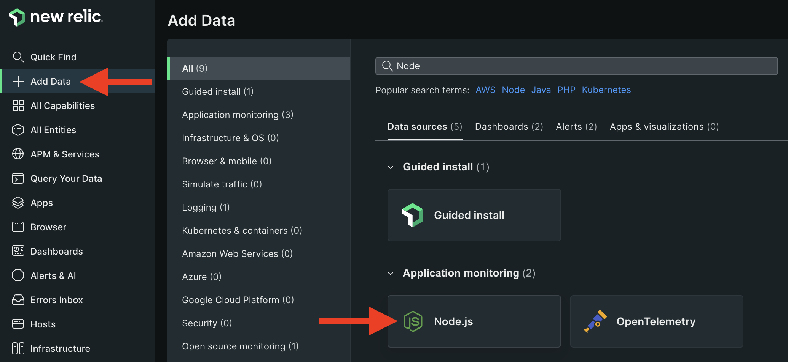
* For Instrumentation Method, select `Docker` 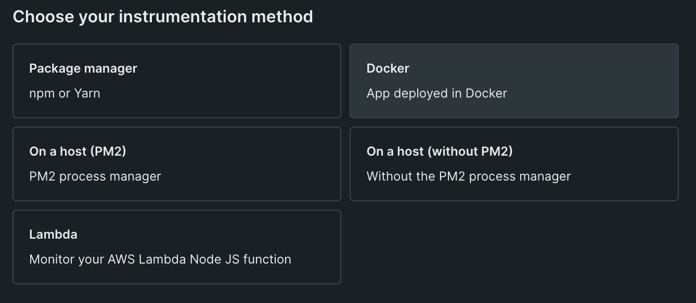
* Give your application a name and click Save.
* Look for the `package.json` file in the `result` folder and add `"newrelic": "latest"` as part of the dependencies 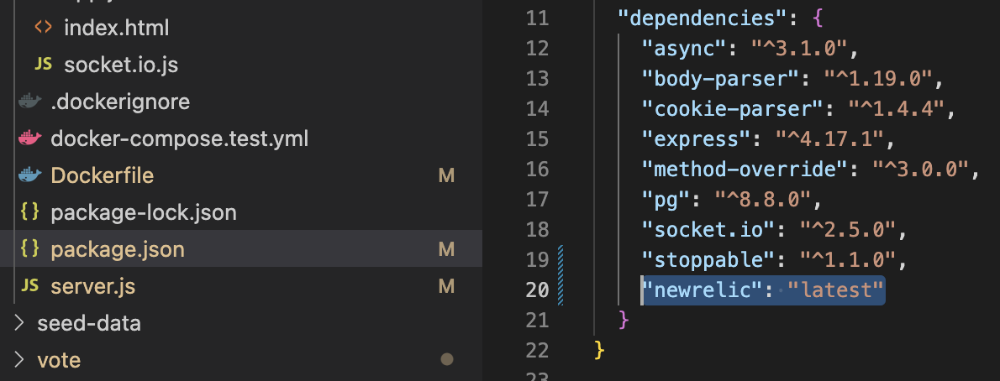
* In the `server.js` file, add this line to the top: `newrelic = require('newrelic');` 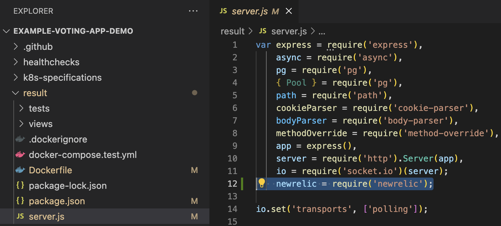
* Setting up your ENV variables
  * For the Dockerfile in the `result` folder, we will need to add this ENV variable `ENV NEW_RELIC_NO_CONFIG_FILE=true` 
  * Since we do not have a newrelic.js file, we will need to setup the ENV variables for our license key and app name. In the same dockerfile, add `ENV NEW_RELIC_APP_NAME=[Insert Different App Name]` and `ENV NEW_RELIC_LICENSE_KEY=[Insert Ingest License Key]`. Make sure to use a unique application name that doesn't exist in New Relic One.
  * Optionally, you can also add other ENV variables like `ENV NEW_RELIC_DISTRIBUTED_TRACING_ENABLED=true \` and `NEW_RELIC_LOG=stdout`. Please refer to [here](https://docs.newrelic.com/docs/apm/agents/nodejs-agent/installation-configuration/nodejs-agent-configuration). 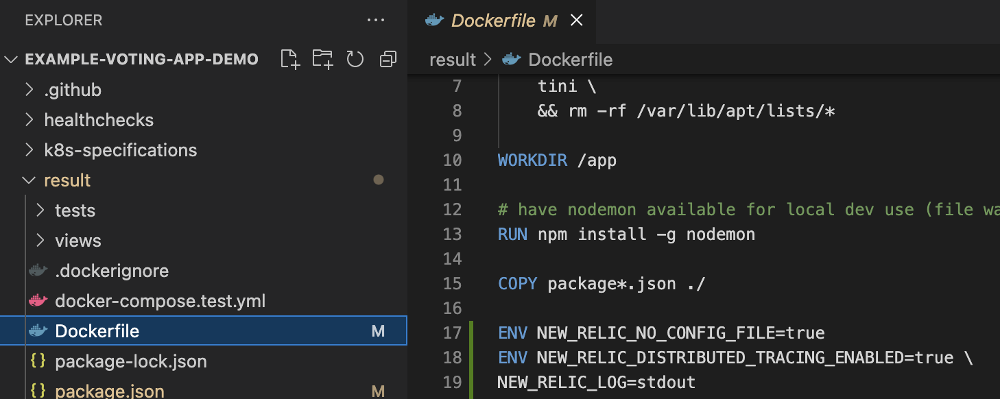
* In your terminal, run this following command to build your Docker containers: `docker compose build --no-cache`
  * Afterwards, we can run the Docker images by executing `docker compose up`
* Continue to the next step in New Relic One to test for a successful connection 

</details>

## Building a Dashboard
<details>
 <summary>Instructions</summary>
 
* We will need to send some custom events in order to create a custom dashboard
  * In `vote/app.py` add these 2 lines at the top
  ```
  import newrelic.agent
  newrelic.agent.initialize('/app/newrelic.ini')
  ```
  * After line 39, we will add this block of code to customize an event and to send it to New Relic
  ```
  cats = 0
  dogs = 0
  params = None
  if vote == 'a':
      params = {'cats': 1}
  if vote == 'b':
      params = {'dogs': 1}
  newrelic.agent.record_custom_event('votes', params,application=newrelic.agent.application())
  ```
  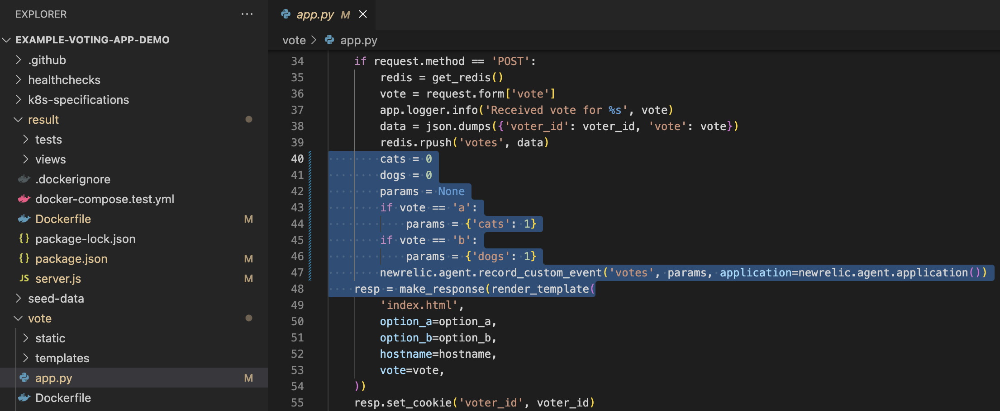
  * Run your app and the custom events data should flow into New Relic One

* In your New Relic One dashboard on the left, click on `Dashboards`, then on the top right, click on `Create a dashboard`
 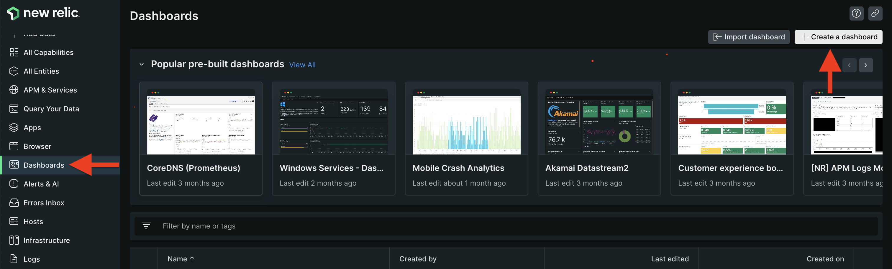
 
* Select `Create a new dashboard` and on the next page, enter a name before proceeding.
 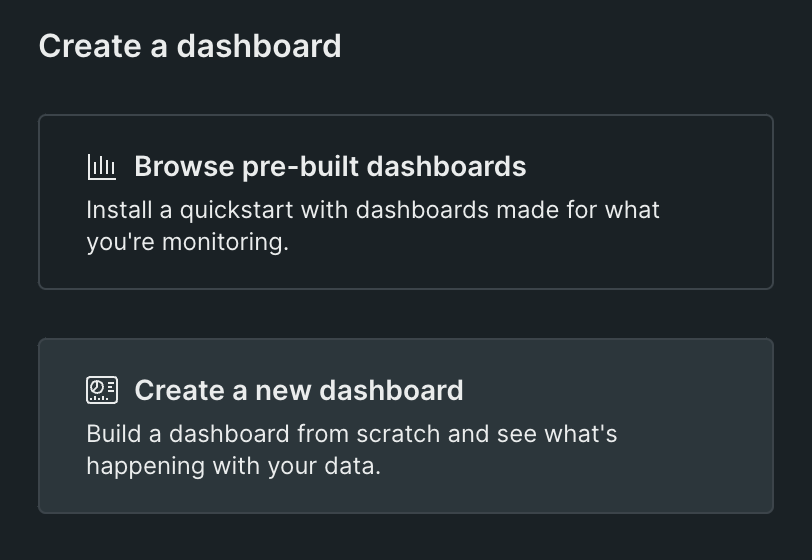 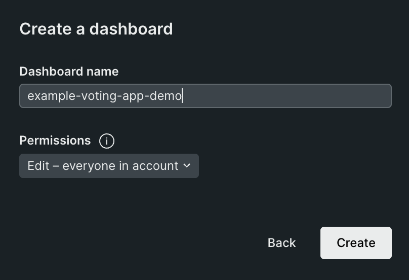

* Click on any panel to `Add a new chart` and in the pop-up on the right, select `Add a chart`
 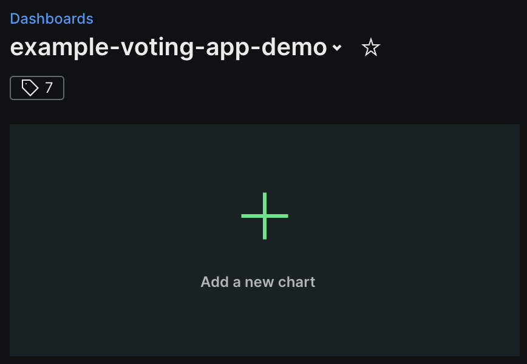 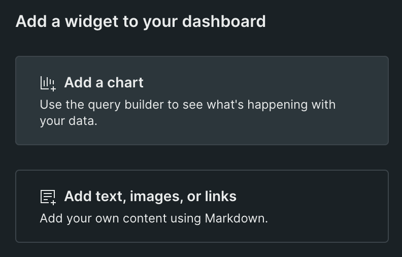
 
* Enter the follow query `SELECT count(*) FROM votes FACET appName TIMESERIES SINCE 5 hours ago` and hit the `Run` button. You should be able to see a chart of the results being sent from the application. You can also customize how the chart looks, for example, we can change the "Chart Type"
 
 
* Changing the "Chart Type" to Stacked Bar will look like this: 
 
</details> 

## Run the app in Kubernetes
<details>
 <summary>Steps</summary>
 
 The folder k8s-specifications contains the YAML specifications of the Voting App's services.

Run the following command to create the deployments and services. Note it will create these resources in your current namespace (`default` if you haven't changed it.)

```shell
kubectl create -f k8s-specifications/
```

The `vote` web app is then available on port 31000 on each host of the cluster, the `result` web app is available on port 31001.

To remove them, run:

```shell
kubectl delete -f k8s-specifications/
```
</details>


## Notes

The voting application only accepts one vote per client browser. It does not register additional votes if a vote has already been submitted from a client.

This isn't an example of a properly architected perfectly designed distributed app... it's just a simple
example of the various types of pieces and languages you might see (queues, persistent data, etc), and how to
deal with them in Docker at a basic level.
